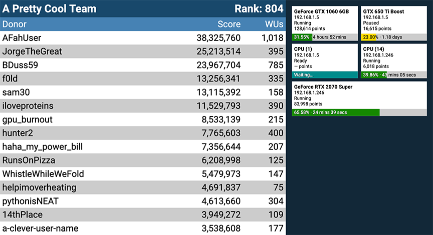

# PyFahViewer - A Folding@Home Wall Display

[](https://travis-ci.com/BrandonDusseau/pyfahviewer)

This application serves as a wall display for viewing your Folding@Home team ranking and work unit progress.



## Requirements

 * Python 3.5+
 * `virtualenv` (`pip install virtualenv`)
 * FAHClient version 7.4+

## Getting Started

1. Copy `config.example.json` to `config.json` and input your configuration parameters. See the _Configuration_ section for details.

2. From the Folding@Home client, go to Configure > Remote Access.

   1. Configure a password if desired.
   2. Under **IP Address Restriction** follow the instructions to configure a subnet that will allow the server running this application to reach the client.
   3. If you chose not to use a password, also configure this subnet under **Passwordless IP Address Restriction**.
   4. You may need to close the advanced control and restart Folding@Home for the changes to take effect.

3. Install dependencies and set up the virtual environment:
    ```bash
    virtualenv venv
    source venv/bin/activate
    pip install -r requirements.txt
    ```

4. Start the application while inside the virtualenv:
    ```bash
    // On some systems it may be necessary to change 'python' to 'python3' for Python 3.x.
    python pyfahviewer/main.py
    ```

5. Navigate to `http://localhost:5000` in your browser.

6. When you're finished, you can press Ctrl+C in the terminal to stop the server, then run `deactivate` to return to your normal shell.

## Configuration

The application uses a JSON-based configuration file, like so:

```json
{
  "team": "1",
  "servers": [
    {"address": "192.168.1.10", "password": "abcd1234"},
    {"address": "192.168.1.11"}
  ]
}

```

The parameters are as follows:

 * `team`: Your team id, used to display the leaderboard. You can find this in your Folding@Home client. If this option is omitted, the leaderboard will not display.

 * `servers`: This is a list of servers running the Folding@Home client, formatted as a dictionary with the following options:

   * `address`: The IP address or hostname of the server. Note that using hostname may slow down fetches.

   * `password`: The password configured on the server. Omit this option if the server does not use a password. Authentication is also skipped if the password is null or the empty string.
